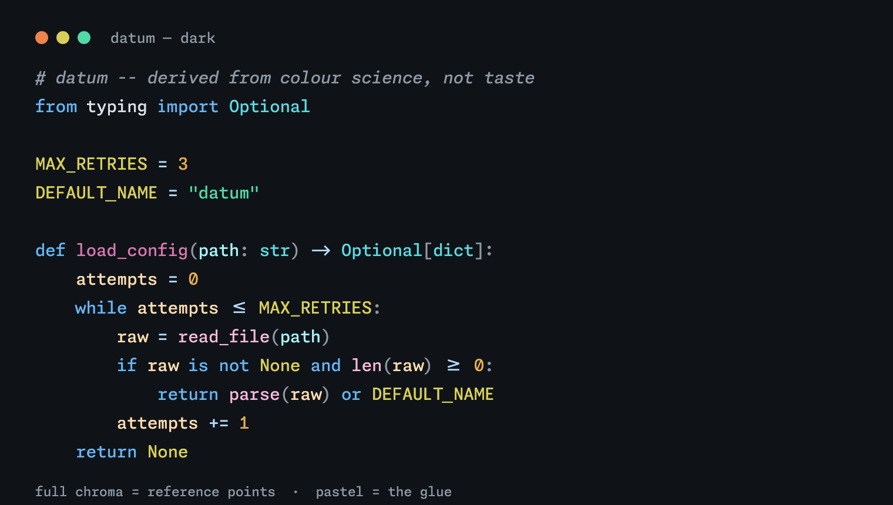
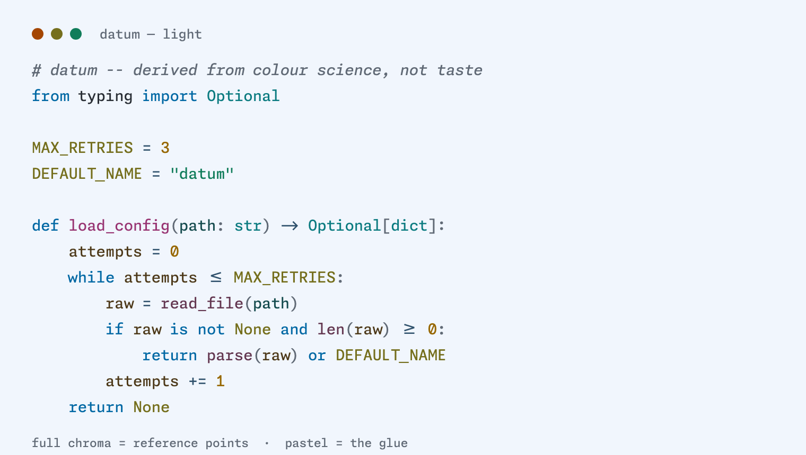

# datum

A light and dark colorscheme for Vim and Neovim that is **derived, not picked**.

Most schemes are tuned by nudging hex values until a sample file looks right on the author's
monitor. Every color here comes out of a reproducible pipeline instead: hue angles anchored on the
**Okabe–Ito** colorblind-safe set, placed in **OKLCH**, verified against **WCAG 2.2** and **APCA**
contrast, and validated by simulating **all three types of color-vision deficiency**. Every number
in the docs is generated by [`tools/derive.py`](tools/derive.py) — and if you disagree with a
choice, the reasoning is written down and the math is right there to re-run.




Every token carries a hue, but **saturation encodes frequency**: the sparse reference points
(strings, numbers, constants, types, definitions) run at full chroma, while the ubiquitous glue
(variables, calls, parameters, operators — about 75% of the text) gets quiet pastels of the same
hue. Vivid, but still hierarchical.

📄 **[Design whitepaper](docs/whitepaper.html)** — the eleven research findings it's built on, the
derivation pipeline, the full palette tables, and the CVD numbers including the ones that aren't
flattering. A living document: the palette and the paper move together.

🎨 **[Palette reference + live preview](docs/index.html)** — contrast readouts computed in your
browser, so you can check the whitepaper's claims against the actual hex values.

## Install

**vim-plug**
```vim
Plug 'w0zro/datum.nvim'
```

**packer.nvim**
```lua
use 'w0zro/datum.nvim'
```

**Manual**

Copy `colors/datum.vim` into your `~/.vim/colors/` (or `~/.config/nvim/colors/`) directory.

## Usage

```vim
set termguicolors      " recommended — renders the exact designed colors
set background=dark    " or light
colorscheme datum
```

The palette is **truecolor-first**: `termguicolors` (Neovim, or a truecolor Vim) shows the exact
hex values. A 256-color terminal fallback is provided, but the cterm cube can only approximate —
most visibly, the light-mode off-white flattens toward white (see the whitepaper's terminal
caveat). Requires 256-color support at minimum (`set t_Co=256` if not auto-detected).

Switching modes is just `:set background=light` (or `dark`) — Vim reloads the colorscheme
automatically when `background` changes and `g:colors_name` is set.

**Tree-sitter recommended.** The two chroma tiers rely on Tree-sitter's captures to tell a
function *call* from a *definition* and to colour variables, parameters and operators. Under base
regex syntax those fall back to plain foreground — still legible, just less of the colour. datum
sets both the classic Vim groups and the `@*` Tree-sitter groups.

## Design at a glance

- **Data-anchored hues.** Accent hue angles come from the Okabe–Ito colorblind-safe qualitative
  set (blue = keywords, orange = numbers, yellow = constants, green = strings, teal = types,
  purple = function defs, red = errors). Cool is how the code is built, warm is the data running
  through it, purple is what you named, red is what's broken.
- **Two moods, one identity.** Every accent keeps the same OKLCH hue angle across modes; only
  lightness and chroma change per background. A dark theme is *not* an inverted light one.
- **Chroma-tiered highlighting.** Every token carries a hue, but *saturation encodes frequency*.
  The sparse reference points (strings, numbers, constants, types, definitions) run at full chroma;
  the ubiquitous glue (variables, function calls, parameters, operators — ~75% of the text) gets
  quiet pastels of the same hue, separated from their siblings by lightness. Vivid, but hierarchical.
- **Accessible by construction.** All eleven syntax colors clear WCAG 4.5:1 in both modes; APCA
  and color-vision-deficiency simulation (all three types, across the full palette) guided every
  tuning decision.

Full reasoning and the reproducible derivation script (`tools/derive.py`) are in the
[whitepaper](docs/whitepaper.html).

## Ports

Terminal palettes live in `ports/`. **They are generated, never hand-written** — a hand-maintained
port is how a stale color sneaks in (it happened once here already, which is why this exists).

```sh
python3 tools/derive.py            # palette + contrast + CVD report
python3 tools/derive.py --json     # the palette as JSON (source of truth for ports)
python3 tools/gen_ports.py         # regenerate ports/
python3 tools/gen_ports.py --check # non-zero exit if a port is stale
python3 tools/gen_preview.py       # regenerate the README preview images
```

- **Ghostty** — `ports/ghostty/datum-{dark,light}`. Copy or symlink into
  `~/.config/ghostty/themes/`, then follow the system appearance:
  ```
  theme = light:datum-light,dark:datum-dark
  ```

The 16 ANSI slots carry the whole palette, not just part of it: normal slots 1–6 are the tier-1
accents, and the bright slots 9–14 carry `orange` (which has no ANSI slot of its own) plus the
tier-2 pastels — so the loud/quiet tier system reaches any 16-color CLI tool, and it follows
light/dark automatically.

*Note: the preview images are faithful renders of the derived palette, not screenshots of a live
editor — Tree-sitter is what assigns these roles in a real buffer.*
